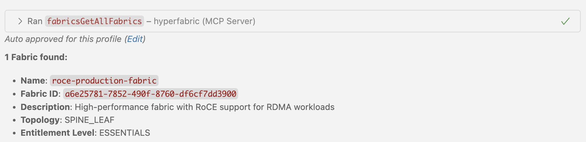
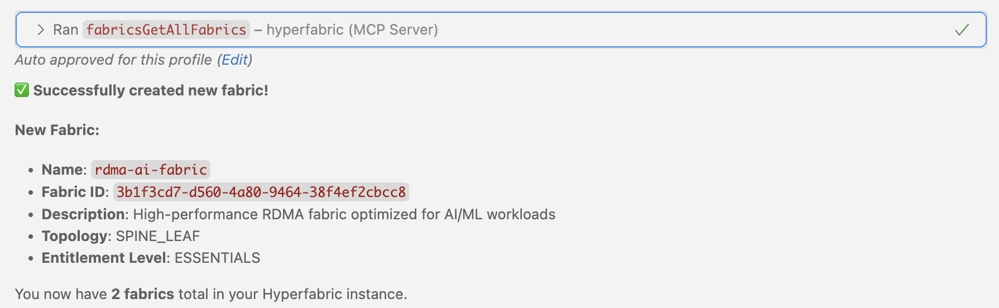

# Hyperfabric MCP Server

An MCP (Model Context Protocol) server that enables LLMs to interact with Hyperfabric APIs. This server exposes all 79 Hyperfabric OpenAPI endpoints as tools for comprehensive infrastructure management and automation.

**🔧 Dynamic Tool Generation**: Automatically parses Hyperfabric OpenAPI specs and creates MCP tools  
**🛡️ Secure Authentication**: Handles Hyperfabric API token authentication with proper security  
**📊 Complete API Coverage**: Exposes all 79 available Hyperfabric endpoints for infrastructure management  
**✨ Clean Tool Names**: Tools display with intuitive names like `fabricsGetAllFabrics` for easy discovery

### Prerequisites

- Node.js 18+ installed
- VSCode with GitHub Copilot or Claude Desktop
- Hyperfabric API credentials (API Token)
- Hyperfabric OpenAPI specification file

### 1. Build the Server

```bash
npm install
npm run build
```

### 2. Configure LLM Client

#### For VSCode with GitHub Copilot

1. Open VSCode Settings: `Cmd+Shift+P` → "Preferences: Open User Settings (JSON)"

2. Add this configuration to your `settings.json`:

```json
{
  "github.copilot.chat.mcp.servers": {
    "hyperfabric": {
      "command": "node",
      "args": ["/path/to/hyperfabric-mcp-server/dist/main.js"],
      "env": {
        "HYPERFABRIC_API_TOKEN": "your-api-token",
        "LOG_LEVEL": "info"
      }
    }
  }
}
```

3. Reload VS Code: `Cmd+Shift+P` → "Developer: Reload Window"

#### For Claude Desktop

1. Locate your Claude Desktop configuration file:
   - **macOS:** `~/Library/Application Support/Claude/claude_desktop_config.json`
   - **Windows:** `%APPDATA%\Claude\claude_desktop_config.json`
   - **Linux:** `~/.config/Claude/claude_desktop_config.json`

2. Add this configuration to `claude_desktop_config.json`:

```json
{
  "mcpServers": {
    "hyperfabric": {
      "command": "node",
      "args": ["/path/to/hyperfabric-mcp-server/dist/main.js"],
      "env": {
        "HYPERFABRIC_API_TOKEN": "your-api-token",
        "LOG_LEVEL": "info"
      }
    }
  }
}
```
3. Restart Claude Desktop application





## Available Tools and Capabilities

The MCP server automatically generates **79 tools** from the complete Nexus Hyperfabric REST API v1.1.0 specification:

### � Authentication & User Management (9 tools)

- **Bearer Token Management**: Secure API authentication
  - `authGetBearerTokens` - List all bearer tokens for the user
  - `authCreateBearerTokens` - Create new bearer tokens
  - `authGetBearerToken` - Get specific bearer token details
  - `authDeleteBearerToken` - Delete a specific bearer token

- **User Management**: User account operations
  - `authGetUsers` - List all users in organization
  - `authGetUser` - Get specific user details
  - `authSetUsers` - Create or update users
  - `authUpdateUser` - Update existing user
  - `authDeleteUser` - Delete a user account

### 🖥️ Device Management (3 tools)

- **Device Operations**: Physical device management and binding
  - `devicesGetDevices` - List all devices (bound and unbound)
  - `devicesBindDevice` - Bind a device to a fabric node
  - `devicesUnbindDevice` - Unbind device from a fabric node

### 🏗️ Fabric Management (16 tools)

- **Fabric Configuration**: Core fabric operations
  - `fabricsGetAllFabrics` - List all fabrics in organization
  - `fabricsAddFabrics` - Create new fabrics
  - `fabricsGetFabric` - Get specific fabric details
  - `fabricsUpdateFabric` - Update fabric configuration
  - `fabricsDeleteFabric` - Delete a fabric

- **Connection Management**: Fabric network connections
  - `fabricsGetFabricConnections` - List all connections in fabric
  - `fabricsAddFabricConnections` - Add new connections
  - `fabricsGetFabricConnection` - Get specific connection details
  - `fabricsSetFabricConnections` - Replace all connections
  - `fabricsDeleteFabricConnections` - Delete all connections
  - `fabricsDeleteFabricConnection` - Delete specific connection

- **Configuration Management**: Candidate configurations and deployment
  - `fabricsGetFabricCandidates` - List candidate configurations
  - `fabricsGetFabricCandidate` - Get specific candidate config
  - `fabricsCommitFabricCandidate` - Deploy candidate to running config
  - `fabricsRevertFabricCandidate` - Discard candidate configuration
  - `fabricsReviewFabricCandidate` - Add comments to candidate config

### 🌐 Network Configuration (3 tools)

- **Spanning Tree Protocol**: Global STP settings
  - `networksGetFabricStp` - Get fabric STP configuration
  - `networksUpdateFabricStp` - Update STP settings
  - `networksResetFabricStp` - Reset STP to defaults

### � Node Management (25 tools)

- **Node Operations**: Fabric node configuration
  - `nodesGetFabricNodes` - List all nodes in fabric
  - `nodesAddFabricNodes` - Add new nodes to fabric
  - `nodesGetNamedFabricNode` - Get specific node details
  - `nodesUpdateFabricNode` - Update node configuration
  - `nodesDeleteFabricNode` - Remove node from fabric

- **Port Management**: Node port configuration
  - `nodesGetPorts` - List all ports for a node
  - `nodesGetPort` - Get specific port details
  - `nodesUpdatePort` - Update port configuration
  - `nodesSetPorts` - Replace all port configurations
  - `nodesResetPort` - Reset port to defaults

- **Management Ports**: Out-of-band management interfaces
  - `nodesGetManagementPorts` - List management ports
  - `nodesAddManagementPorts` - Add management ports
  - `nodesGetManagementPort` - Get specific management port
  - `nodesUpdateManagementPort` - Update management port config

- **Loopback Interfaces**: Virtual interfaces for routing
  - `nodesGetNodeLoopbacks` - List loopback interfaces
  - `nodesAddNodeLoopbacks` - Create loopback interfaces
  - `nodesGetNodeLoopback` - Get specific loopback details
  - `nodesUpdateNodeLoopback` - Update loopback configuration
  - `nodesDeleteNodeLoopback` - Delete loopback interface

- **Sub-Interfaces**: VLAN and sub-interface configuration
  - `nodesGetNodeSubInterfaces` - List sub-interfaces
  - `nodesAddNodeSubInterfaces` - Create sub-interfaces
  - `nodesGetNodeSubInterface` - Get specific sub-interface
  - `nodesUpdateNodeSubInterface` - Update sub-interface config
  - `nodesDeleteNodeSubInterface` - Delete sub-interface

### � Port Channel Management (5 tools)

- **Link Aggregation**: Port channel operations
  - `portchannelsGetAllPortChannels` - List all port channels
  - `portchannelsAddPortChannels` - Create port channels
  - `portchannelsGetPortChannel` - Get specific port channel
  - `portchannelsUpdatePortChannel` - Update port channel config
  - `portchannelsDeletePortChannel` - Delete port channel

### 🏷️ VNI Management (9 tools)

- **Virtual Network Identifiers**: VXLAN network segmentation
  - `vnisGetFabricVnis` - List all VNIs in fabric
  - `vnisAddFabricVnis` - Create new VNIs
  - `vnisGetFabricVni` - Get specific VNI details
  - `vnisUpdateFabricVni` - Update VNI configuration
  - `vnisDeleteFabricVni` - Delete VNI

- **VNI Membership**: Member interface management
  - `vnisGetFabricVniMembers` - List VNI members
  - `vnisAddFabricVniMembers` - Add members to VNI
  - `vnisGetFabricVniMember` - Get specific member details
  - `vnisDeleteFabricVniMember` - Remove member from VNI

### �️ VRF Management (9 tools)

- **Virtual Routing and Forwarding**: Layer 3 network isolation
  - `vrfsGetFabricVrfs` - List all VRFs in fabric
  - `vrfsAddFabricVrfs` - Create new VRFs
  - `vrfsGetFabricVrf` - Get specific VRF details
  - `vrfsUpdateFabricVrf` - Update VRF configuration
  - `vrfsDeleteFabricVrf` - Delete VRF

- **Static Routing**: Static route management within VRFs
  - `vrfsGetFabricStaticRoutes` - List static routes in VRF
  - `vrfsAddFabricStaticRoutes` - Add static routes
  - `vrfsGetFabricStaticRoute` - Get specific route details
  - `vrfsUpdateFabricStaticRoute` - Update static route
  - `vrfsDeleteFabricStaticRoute` - Delete static route

## Environment Variables

| Variable | Description | Default | Required |
|----------|-------------|---------|----------|
| `HYPERFABRIC_API_TOKEN` | Your Hyperfabric API token | - | ✅ |
| `LOG_LEVEL` | Logging level (debug, info, warn, error) | info | ❌ |
| `OPENAPI_SPEC_PATH` | Path to OpenAPI spec file | hf_spec_modified.json | ❌ |

## Development Setup

### Project Structure

```
hyperfabric-mcp-server/
├── src/main.ts                                                    # Main server implementation
├── dist/                                                          # Compiled JavaScript
├── .vscode/                                                       # VS Code configuration
├── package.json                                                   # Dependencies & scripts
├── tsconfig.json                                                  # TypeScript config
├── hf_spec_modified.json                                          # Complete Nexus Hyperfabric REST API v1.1.0 spec
├── cisco_nexus_hyperfabric_rest_api_1_1_0_rev_2025_10_29_838_c_8.yaml # Original YAML spec file
└── README.md                                                      # This documentation
```

## Troubleshooting

### Common Issues

**Missing API Token**
```bash
# Check environment file
cat .env | grep HYPERFABRIC_API_TOKEN
```

**Missing OpenAPI Spec**
```bash
# Verify spec file exists
ls -la hf_spec_modified.json
```

**Compilation Errors**
```bash
# Check compilation
npm run build
```
